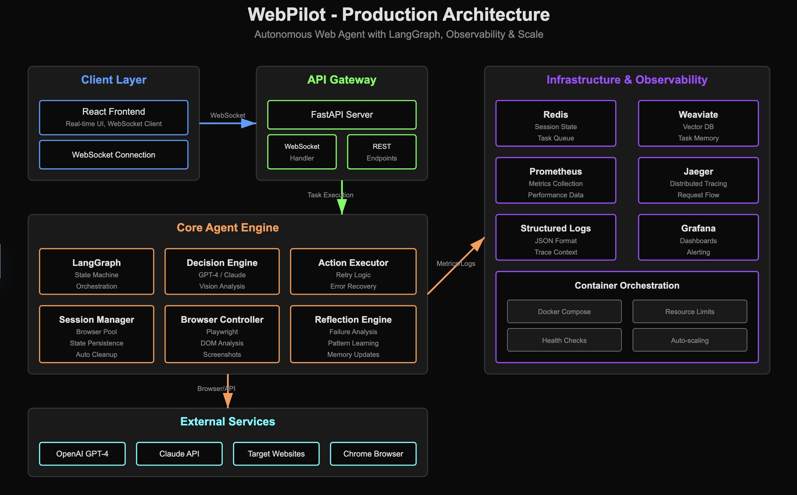

# 🕸️ WebPilot

WebPilot is an autonomous AI agent that browses the web and completes tasks via natural language — booking flights, filling forms, comparing prices, and more. It combines LLM reasoning, LangGraph state machines, and Playwright browser automation to emulate how a human interacts with the web.

---

## 🧠 Core Features

- 🧾 Natural language understanding — "Find me the cheapest flight to Tokyo and book it"
- 🧭 Multi-step planning with LangGraph
- 🖥️ Webpage interaction using Playwright (click, scroll, form-fill)
- 🧠 Visual reasoning with GPT-4V or Claude (screenshot analysis)
- 📚 Memory system with Redis and vector DB (task reflection and learning)
- 📈 Observability (Prometheus + Jaeger-ready)
- 🔐 Safety checks before purchases or dangerous actions

---

## 🧱 Architecture



---

## 🚀 Quick Start

### 1. Clone and enter the repo

```bash
git clone https://github.com/yourname/webpilot.git
cd webpilot
```

### 2. Set up environment

```bash
cp .env.example .env
# Edit .env to insert your OpenAI key
```

### 3. Launch stack

```bash
docker-compose up --build
```

- Backend: http://localhost:8000
- Swagger: http://localhost:8000/docs
- Redis: redis://localhost:6379

---

## 🧪 Local Dev

```bash
python3 -m venv venv
source venv/bin/activate
pip install -r requirements.txt
uvicorn app.main:app --reload
```

---

## 🧩 Technologies

- **LLM Planner**: OpenAI GPT / Claude / function-calling
- **LangGraph**: Robust state machines and edge tracking
- **Playwright**: Web automation
- **FastAPI**: API backend
- **React + WebSocket**: Real-time frontend interface
- **Redis**: Session + memory storage
- **Prometheus + Jaeger**: Observability stack

---

## 💡 Demo Tasks

- Find and book flights under $500 next month
- Fill out job application forms across job boards
- Compare prices across 3 e-commerce sites
- Collect research from multiple sites and summarize
- Schedule tweets/posts across social platforms

---

## 📦 Repo Layout

```
.
├── app/                # FastAPI backend
├── agent/              # LangGraph, planner, state mgmt
├── browser/            # Playwright controller
├── infrastructure/     # Session pooling, observability
├── utils/              # LLM-safe parsing, helpers
├── react-ui/           # React frontend (WebSocket client)
├── tests/              # E2E and unit tests
```

---

## ✅ Status

🧠 MVP is complete — core logic is working  
🚧 Edge cases, reconnections, and LLM hallucination handling in progress  

---

